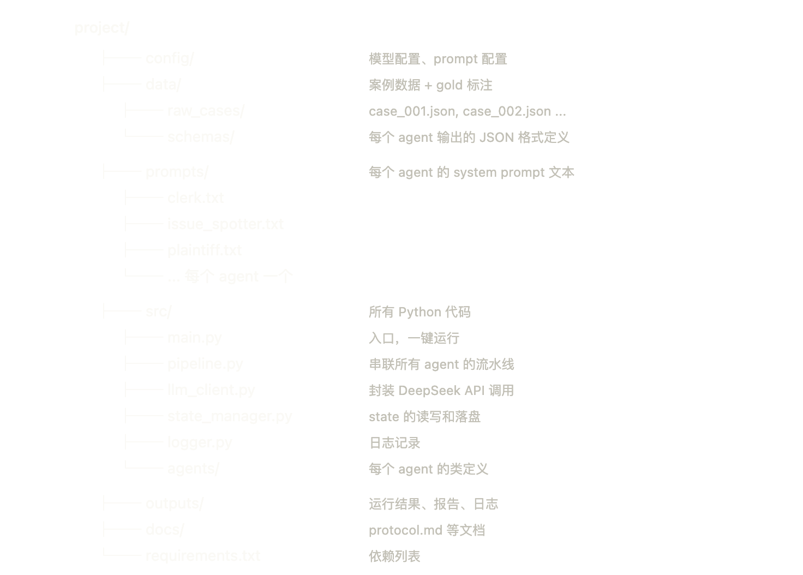
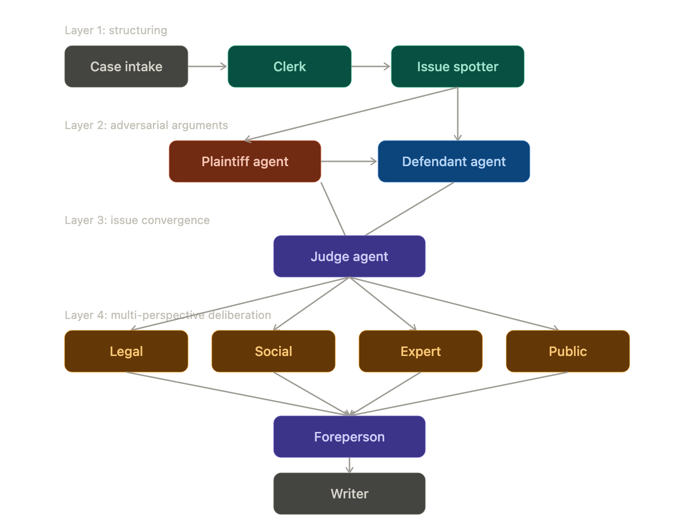
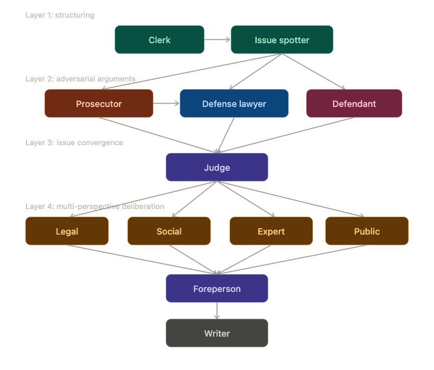

# 记录
## 一、4.28 
- 重新开工，古法编程版
- 搭建项目骨架

- 添加data/ 包含raw_cases/ 和 gold_annotations/ 各10条

## 二、5.6
- 新的pipeline 

### 1.Agent 文件
- 删除 plaintiff.py，新建 prosecutor.py
- 原 defendant.py 改为 defense_lawyer.py
- 新建 defendant.py（被告人陈述角色）
- judge.py input_fields 更新：prosecutor_analysis + defense_analysis + defendant_statement
- reviewer.py 从四参数（含 prompt_file, prompt_key）简化为三参数
- 所有 Agent 去掉 prompt_file 和 prompt_key，统一用 name 自动推导 prompt 路径
### 2.base_agent.py
- prompt 读取方式从 JSON（prompt_file + prompt_key）改回 .txt（prompts/{name}_prompt.txt）
### 3.pipeline.py
- 导入更新：PlaintiffAgent → ProsecutorAgent + DefenseLawyerAgent + DefendantAgent
- 线性链路：Clerk → IssueSpotter → Prosecutor → DefenseLawyer → Defendant → Judge

### 4.main.py
- 入参从 case_id 改为完整文件路径（python -m src.main data/cases/xxx.json）
- case_id 从文件内容中读取

### 5.Prompt 文件
- 替换为 coworker 提供的刑事版 .txt prompt
- reviewer prompt 从 reviewer_prompts.json 拆分为 legal/social/expert/public 四个独立 .txt
- 修复 writer_prompt 和 foreperson_prompt 缺 JSON schema 的问题

### 6.数据
- data/raw_cases/ 替换为 data/cases/（刑事案例 5 个）
- 新增 case_input.json、role_information.json、personality_profiles.json

### 7.round2设计
- Round 2 deliberation 加入 pipeline.py（Round 1 独立发言 + Round 2 有限回应）
- foreperson 改为读取两轮输出（reviewer_outputs + round2_outputs）
- main.py 升级：支持 --all 批量跑、JSON + Markdown 双输出
- 加入 report_utils.py（Markdown 报告生成）

- 待办：批量跑全部案例、评估脚本、消融实验、Writer 双模式

## 三、5.7
- 完成Writer 双模式
- 增加角色信息读取和信息分化

## 四、5.9
- 升级 agent_output_schemas.json
  - prosecutor / defense_lawyer / judge 字段改为争点-证据-推理结构
  - 新增 reviewer_round1 / reviewer_round2 / deliberation_room
  - 保留 foreperson 兼容旧 pipeline
- 升级 prosecutor_prompt 和 defense_lawyer_prompt
  - prosecutor 增加 evidence_issue_map、proving purpose、prosecution strength
  - defense_lawyer 增加逐证据攻击：真实性、关联性、证明力
- 升级 Deliberation Room prompt
  - opening 增加 issue_proof_status
  - response 增加 open_proof_gap、issue_status_after_response、issue_status_updates
- 升级 pipeline.py 的 deliberation_room state
  - 增加 participants、rounds、vote_history、alliance_map、disagreement_map
  - 增加 state_changes、issue_status_timeline、final_meeting_result
  - final_meeting_result 增加 final_issue_status
- 升级 report_utils.py
  - Markdown 报告新增“Deliberation Room：争点证明状态总表”
- 新增 EVALUATION.md
  - 增加 5 个刑事案例的人工评估说明和评分表
- 新增 README.md
  - 改成课程项目展示首页
  - 补充 Project Overview、Key Features、System Architecture、运行方式和输出文件说明
- 新增 dataset statistics
  - 新建 scripts/compute_dataset_stats.py
  - 统计 data/cases/ 下 5 个刑事案例的案件数量、证据数量、reviewer 数量和人格维度
  - 输出 outputs/dataset_statistics.json 和 outputs/dataset_statistics.md
- 批量运行 5 个案例
  - 生成 outputs/criminal_001 到 outputs/criminal_005 的 state_final.json 和 final_report.md
  - Markdown 报告中已包含 Deliberation Room 争点证明状态总表
