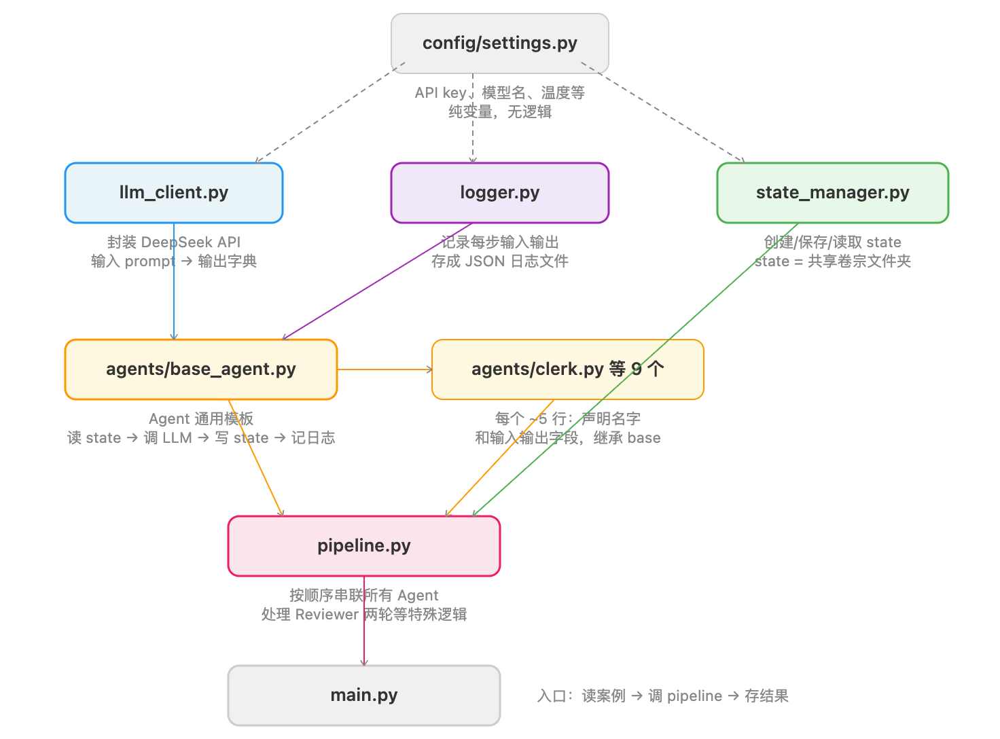

| 文件名 | name | input_fields | output_field |
|---|---|---|---|
| clerk.py | "clerk" | ["raw_case_text"] | "case_structured" |
| issue_spotter.py | "issue_spotter" | ["case_structured"] | "issues" |
| plaintiff.py | "plaintiff" | ["case_structured", "issues"] | "plaintiff_analysis" |
| defendant.py | "defendant" | ["case_structured", "issues", "plaintiff_analysis"] | "defendant_analysis" |
| judge.py | "judge" | ["issues", "plaintiff_analysis", "defendant_analysis"] | "judge_summary" |
| foreperson.py | "foreperson" | ["judge_summary", "reviewer_outputs"] | "foreperson_summary" |
| writer.py | "writer" | ["case_structured", "issues", "judge_summary", "foreperson_summary"] | "final_report" |